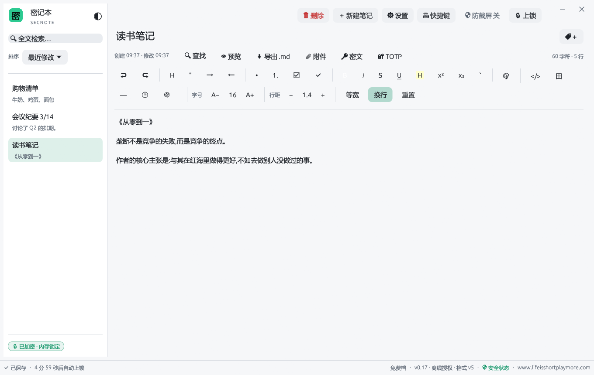
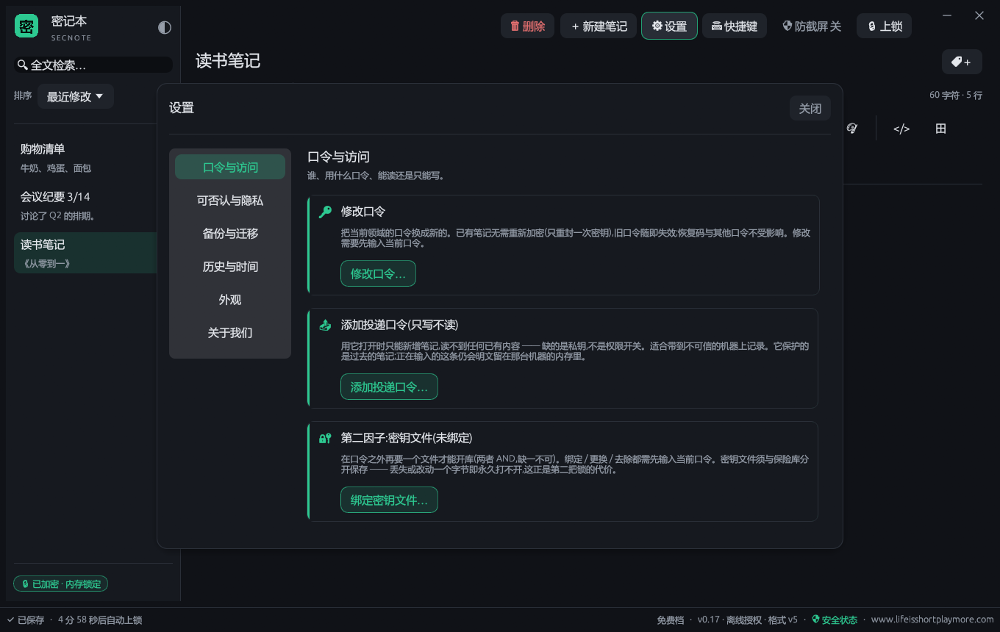
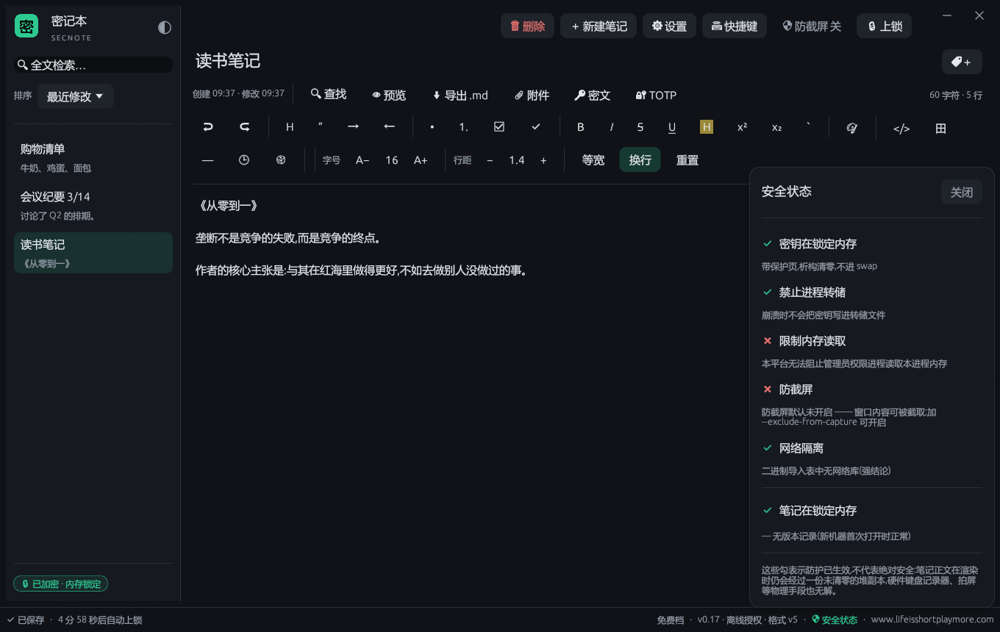
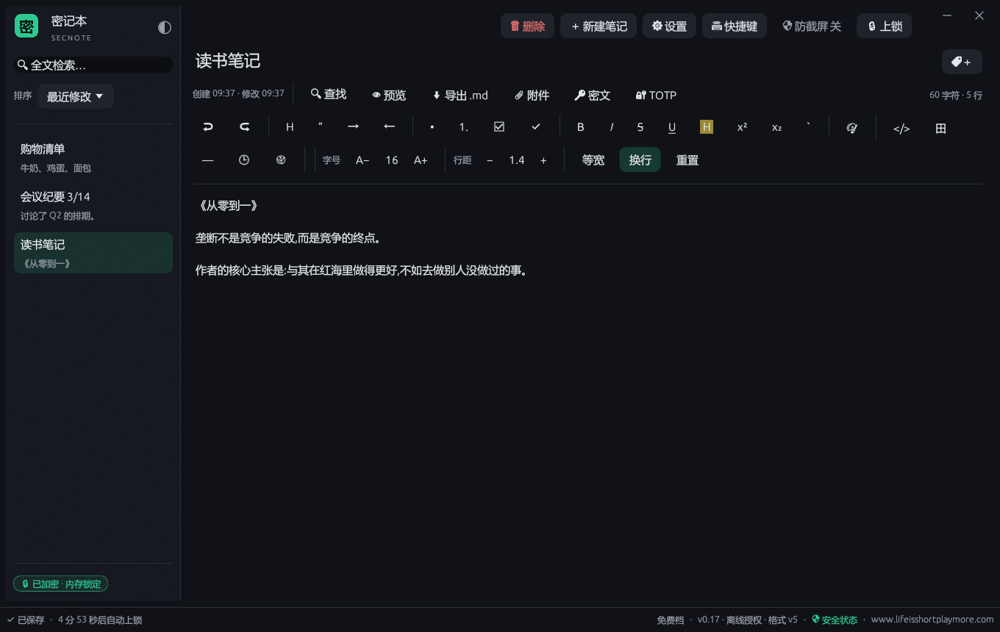
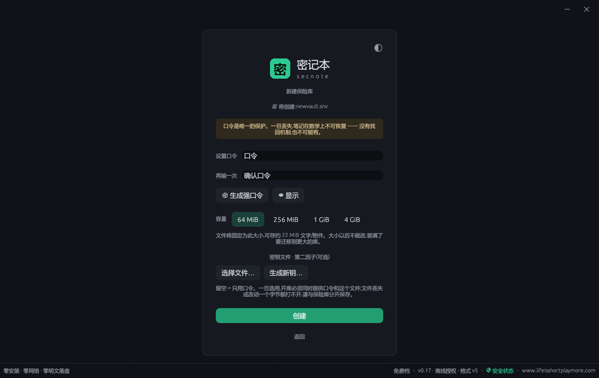

<div align="center">

# 🛡 密记本 · SECNOTE

### 为"安全"而生的加密记事本 —— 零安装 · 零网络 · 零明文落盘

把你最不想被人看到的文字,锁进一个连大小都不会变化的加密文件里。<br>
口令是唯一的钥匙;程序全程不联网、不注册账号、明文只在锁定内存里,绝不落盘。

**[⬇ 最新便携版 · Releases](../../releases/latest)** &nbsp;|&nbsp; **[☁ 百度网盘下载](https://pan.baidu.com/s/1wew4TdhuaoIUuuAlZmu-IA?pwd=wwsz)**



<sub>Windows 10/11 · 绿色免安装 · 数据全在本地 · 不联网 · 不注册账号 · 明暗双主题</sub>

</div>

---

## 📖 这是什么

**密记本(secnote)** 是一个桌面加密记事本。它只做一件事,并且把这件事做到偏执:**让你写下的字,除了你、谁也读不到。**

它把你的全部笔记装进**一个文件**(保险库,`.snv`)。这个文件在磁盘上就是一团无法辨认的随机字节 —— 没有魔数、没有可识别的头、连文件大小都是恒定的,别人**看不出里面有多少笔记、有没有笔记、甚至它是不是一个密记本文件**。只有输入正确的口令,内容才会在内存里解开;你一上锁或一关程序,明文立即从内存清零。

> 它不是云笔记、不是同步工具,也**不需要联网**。它是那种"写完锁上、钥匙只在你脑子里"的本地保险箱 —— 适合放口令、私钥助记词、隐私记录、不想进任何云的敏感文字。

<div align="center"></div>

---

## ✨ 核心特性详解

### 🔒 静态存储:国际标准强加密,和主流安全软件同一梯队

- **口令派生极其抗暴力破解**:用 **Argon2id**,内存开销拉到 **1 GiB**、多轮迭代 —— 这是专门用来**拖垮显卡与专用硬件**的参数。哪怕攻击者手握你的保险库文件慢慢试口令,每猜一次都要付出高昂的内存与时间代价。
- **正文加密用 XChaCha20-Poly1305**:256 位密钥、带认证标签,业界公认的现代强加密算法(与 Signal、现代 TLS 属同一类国际标准),**改动一个字节都通不过校验**。
- **密钥封装用 HPKE(RFC 9180)**:标准化的混合公钥加密流程,而不是自己拼装的土办法。
- **总体安全强度约 128 位**:和当下主流端到端加密方案是同一量级。

### 🕳 元数据不可见 · 每次保存"满盘皆变"

- **文件大小恒定**:创建时选定容量(如 64 MiB),此后文件大小**永远不变**,不随笔记增减而涨缩 —— 别人无法从体积推测你写了多少。
- **无魔数、无特征**:文件开头没有任何"我是密记本"的标志,整体呈随机字节。
- **每次保存全量重写**:两次保存之间,文件里**几乎每个字节都变** —— 抵御差量分析,看不出你改了哪、改了多少。

### 🫥 可否认加密:隐藏领域 + 销毁密码

给"被逼交出口令"这种极端情况留的后手:

- **隐藏领域**:同一个保险库文件里可以有一个用**另一个口令**才能打开的隐藏空间。用日常口令打开是一套内容,用隐藏口令打开是另一套 —— 而在文件层面,**"有没有隐藏领域"和"从未创建过"完全同构**,无法被证明存在。
- **销毁密码**:一个特殊口令,一旦输入即让密钥在密码学上不可恢复。

### 🔑 第二因子:口令之外,再要一样"东西"

可选给保险库**再加一道锁**,两者是"AND"关系 —— 光有口令还不够:

- **密钥文件**:绑定一个只有你有的文件当第二因子。
- **硬件令牌**:支持 **YubiKey / FIDO2(hmac-secret)**,根秘密**不出芯片**,走系统 WebAuthn。已在真机(YubiKey 5C NFC FIPS)验证。

<div align="center"></div>

### 🧠 内存卫生:明文绝不落盘,连崩溃都不泄

- **锁定内存**:密钥与笔记正文存放在 `mlock` 锁定内存中,带保护页,不进 swap;释放时清零。
- **禁止进程转储**:程序崩溃时不会把内存(含密钥)写进转储文件。
- **一上锁就清零**:上锁、超时自动上锁、关窗,明文即刻从内存抹掉。

<div align="center"></div>

> 密记本有一个**「安全状态」面板**,把每一项防护是否真的生效**逐条摊开**给你看(包括哪些在你当前平台/配置下**没有**生效)—— 一个安全工具最危险的,是让你以为它做到了它没做到的事。密记本选择把话说清楚。

### 🔢 内置离线两步验证(TOTP)

把你各个网站的**两步验证令牌(6 位动态码)**也一起锁进密记本,离线生成、无需再装第三方 Authenticator。标准 RFC 6238,和 Google Authenticator 兼容。

### ⏱ 自动上锁 · 防截屏 · 剪贴板治理(Windows)

- **超时自动上锁**:离开一会儿,自动锁库,明文清零。
- **防截屏**:可让窗口内容无法被普通截屏/录屏工具捕获(Windows 实机验证)。
- **剪贴板治理**:复制敏感内容后限时自动清空,减少残留。

### 📎 附件 · 📝 Markdown · 🔑 密码生成器

- **附件**:把小文件(图片、密钥文件等)一起塞进保险库,内存内预览。
- **Markdown 编辑**:标题、列表、代码块……渲染器**不会**去联网、不加载任何外部资源。
- **强密码生成器 + 库内即时搜索**:随手生成高强度口令;按标题秒搜定位笔记。

### 🕶 无痕模式 · 🎨 深浅主题

- **`--private` 无痕模式**:连"最近打开过哪个库"这类使用痕迹都不留。
- **深色 / 浅色主题**:一键切换,护眼。

| 深色主题 | 浅色主题 |
|:---:|:---:|
|  |  |

### 🟢 绿色免安装 · 本地优先 · 不注册账号

- **解压双击即用**:不写注册表、不留系统残留。
- **数据全在你手里**:就是那个 `.snv` 文件,复制到别的电脑 / U 盘 / 网盘,打开还是原样。
- **不注册、不上传、不联网**:没有账号体系,没有云。

---

## 🧭 它**防不住**什么(我们把话说在前面)

一个安全工具最该坦白的部分。密记本**防不住**:

- **有管理员/ root 权限的攻击者**、内核级 rootkit、恶意固件 —— 任何用户态程序都无能为力。
- **硬件键盘记录器、拿另一台设备拍你的屏幕** —— 这是物理问题,软件无解。
- **你自己忘记口令**。没有找回机制,也不可能有 —— 除非你**事先**生成了离线恢复码。请务必生成并妥善保管。
- **SSD 上的"彻底抹除"**。销毁密码能让密钥在密码学上不可恢复,但不保证旧字节从盘上物理消失;若对方事先做过磁盘镜像,对那份镜像无效。

关于平台:**Windows 是当前完整验证的平台**(零网络可在二进制层面核验、防截屏实机验证)。本发布面向 **Windows 10/11**。

> 密记本**没有经过外部安全审计**,我们也不会写"军工级""绝对安全"这种话。它做的是把现代标准强加密 + 严格的本地隐私工程,老老实实交付给你,并把每一项的边界讲清楚。

---

## 💠 免费版 vs Pro

| | 免费版 | Pro 授权 |
|---|:---:|:---:|
| 完整强加密 · 保险库读写 | ✓ | ✓ |
| 内存卫生 · 零网络 · 零明文落盘 | ✓ | ✓ |
| 元数据不可见(恒定大小 / 全量重写) | ✓ | ✓ |
| **第二因子**(密钥文件 / 硬件令牌) | ✓ | ✓ |
| **离线两步验证(TOTP)** | ✓ | ✓ |
| 自动上锁 · 防截屏 · 剪贴板治理 | ✓ | ✓ |
| 明暗主题 · 全文搜索 · 密码生成器 · 无痕模式 | ✓ | ✓ |
| 保险库容量上限 | 64 MiB | 256 MiB / 1 GiB / 4 GiB |
| 隐藏领域 · 销毁密码 | — | ✓ |
| 版本历史 | — | ✓ |
| 附件 | — | ✓ |
| Markdown 预览 · .md 导出 | — | ✓ |

> **免费档提供完整的加密能力 —— 而且不管授权是什么状态,开库、读写、加密永远满血,你的数据永不被锁定。** 免费版即可用第二因子、TOTP、防截屏这些硬核安全能力;付费授权(Pro)解锁更大容量与隐藏领域、销毁密码、版本历史、附件、Markdown 等便利功能,以及有效期内的更新与支持。价格与购买方式见下载页 / 联系作者。

---

## 🚀 快速上手(约 2 分钟)

**① 下载与运行**<br>
到 [Releases](../../releases/latest) 或[百度网盘](https://pan.baidu.com/s/1wew4TdhuaoIUuuAlZmu-IA?pwd=wwsz)下载便携版,解压,双击 `secnote.exe`。<br>
首次运行若弹「未知发布者 / SmartScreen」,点「更多信息 → 仍要运行」(程序为自签名,尚未购买商用证书,可自行核对 SHA-256)。

**② 新建保险库**<br>
选一个位置新建保险库(一个 `.snv` 文件),设置口令,**选容量**(64 MiB / 256 MiB / 1 GiB / 4 GiB)。容量一旦定死不再改变 —— 这正是"别人看不出你写了多少"的代价与保证。

<div align="center"></div>

**③ 生成离线恢复码**<br>
口令是唯一的钥匙。进设置**生成一份离线恢复码**并妥善保管 —— 这是你唯一的后悔药。

**④ 开始记**<br>
新建笔记、写字、贴密码、加附件。离开自动上锁,回来输口令继续。整个 `.snv` 文件拷到哪,打开都是原样。

> 忘记口令 = 数据不可恢复。这不是缺陷,是设计。请认真对待恢复码。

---

## ⬇ 下载

- **GitHub / Gitee Releases**:[最新便携版](../../releases/latest)(Windows,解压双击即用,免安装)。
- **百度网盘**:<https://pan.baidu.com/s/1wew4TdhuaoIUuuAlZmu-IA?pwd=wwsz>(提取码:`wwsz`)。

下载后建议核对完整性(与发布页公布的 SHA-256 一致即未被篡改):

```powershell
Get-FileHash .\secnote.exe -Algorithm SHA256
```

## 💻 系统要求

- **Windows 10 / 11(64 位)**。
- 无需联网,无需账号,无需任何额外运行库。

---

## ❓ 常见问题

**Q:忘记口令能找回吗?**<br>
不能。没有任何后门或找回机制 —— 有的话就不叫安全了。唯一的兜底是你**事先**在设置里生成的**离线恢复码**,请务必生成并保管好。

**Q:它联网吗?会上传我的笔记吗?**<br>
不联网、不上传。程序没有账号体系,也不含网络功能;笔记只在你本机那个 `.snv` 文件里。

**Q:数据存在哪?换电脑怎么办?**<br>
全部在你选定的那个 `.snv` 保险库文件里。复制到别的电脑 / U 盘 / 网盘,用同一口令打开即可,内容原样。

**Q:为什么弹"未知发布者"?安全吗?**<br>
当前为**自签名**(尚未购买商用代码签名证书),因此 Windows 会提示未知发布者 —— 这只影响"系统是否认识发布者",不影响程序本身。你可核对发布页公布的 SHA-256 自证未被篡改。

**Q:是开源的吗?**<br>
**不是。密记本为专有软件(闭源)**,本仓库仅用于发布下载与说明,不含源代码。

**Q:支持 Mac / Linux 吗?**<br>
本次发布面向 **Windows**。其他平台暂未提供正式发布。

**Q:能放多少笔记?**<br>
取决于你新建保险库时选的容量(如 64 MiB 约可存 22 MiB 文字/附件)。装满了可迁移到更大的库。

---

<div align="center">

## 把不想被看到的字,交给密记本

### **[⬇ 前往 Releases 下载](../../releases/latest)** · **[☁ 百度网盘](https://pan.baidu.com/s/1wew4TdhuaoIUuuAlZmu-IA?pwd=wwsz)**

<sub>© 玩物丧志软件 WANWU LAB · 密记本 secnote 为专有软件,保留一切权利。<br>
本仓库仅用于分发便携版下载,不含源代码。请勿反编译、破解或二次分发。</sub>

</div>
